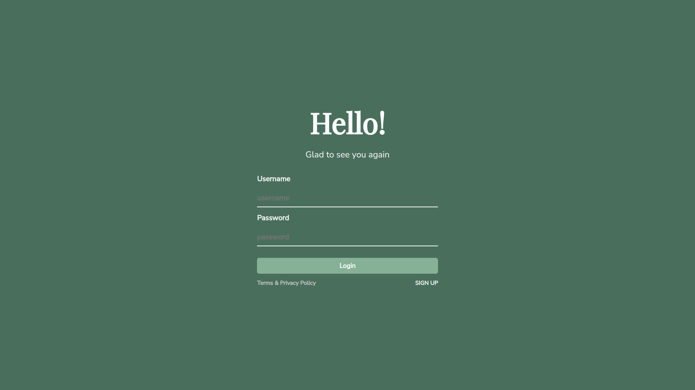

# Aplikasi Yoshiyaki

## Deskripsi Aplikasi Web

Secara umum, sistem ini merupakan sebuah sistem informasi yang digunakan untuk melakukan manajemen / pengelolaan stok dorayaki. Berikut ada beberapa ketentuan umum
yang dimiliki oleha aplikasi kami :

1. Untuk client-side, gunakan Javascript, HTML, dan CSS. Tidak boleh
   menggunakan library atau framework CSS atau JS (e.g. JQuery, lodash, atau
   Bootstrap). CSS sebisa mungkin ada di file yang berbeda dengan HTML (tidak
   inline styling).
2. Untuk server-side, wajib menggunakan PHP murni tanpa framework apapun (e.g
   laravel, codeigniter). Harap diperhatikan, Anda harus mengimplementasikan fitur
   menggunakan HTTP method yang tepat.
3. Untuk basis data, wajib menggunakan SQLite. Skema database dibebaskan,
   namun dapat memenuhi seluruh fitur dari sistem. Disarankan untuk membuat
   database sample yang terpisah dari database asli yang digunakan oleh sistem.
4. Sistem yang dibangun ini bersifat monolithic, artinya interface dan logika
   pemrosesan digabung menjadi satu.

## Daftar Requirement

Membangun sistem yang dapat melakukan pengelolaan stok dorayaki.

1. Seluruh pengguna harus melakukan autentikasi untuk dapat mengakses seluruh
   fitur lainnya. Pengguna dibedakan menjadi 2 kategori: user dan admin.
2. Admin dapat melakukan pengelolaan varian dorayaki.
3. Admin dapat melakukan manajemen stok dorayaki.
4. Admin dapat melihat riwayat perubahan stok dorayaki.
5. User dapat melihat daftar varian dorayaki
6. User dapat melakukan pembelian dorayaki
7. User dapat melihat riwayat pembelian dorayaki.

## Cara Instalasi && Cara menjalankan server

Karena sistem ini dikontenirasi dengan docker, sehingga semua dependensi sudah terinstall dan dikonfigurasi pada docker image dan docker compose, maka hanya diperlukan command sebagai berikut :

Untuk Linux :

```shell
./serve.sh
```

Untuk windows :

```shell
docker-compose up --build
```

## Screenshot tampilan aplikasi

## Halaman User

Potongan gambar halaman login



Potongan gambar halaman register


Potongan gambar halaman utama


Potongan gambar halaman landing page


Potongan gambar halaman search


Potongan gambar halaman riwayat pembelian


Potongan gambar halaman pemesanan dorayaki


Potongan gambar halaman bukti dorayaki berhasil dibeli


Potongan gambar halaman search yang dipagniasi


## Halaman admin

Potongan gambar halaman pengelolaan dorayaki


Potongan gambar halaman paginasi pengelolaan dorayaki


Potongan gambar halaman table list riwayat pengubahan user


Potongan gambar halaman table list riwayat pengubahan admin


Potongan gambar halaman table list pengubahan admin


Potongan gambar halaman menampilkan edit dorayaki


Potongan gambar halaman menampilkan delete dorayaki


Potongan gambar halaman menampilkan edit dorayaki


## Halaman mobile responsive
Potongan gambar halaman login

Potongan gambar halaman register

Potongan gambar halaman search dorayaki

Potongan gambar halaman riwayat pembelian

Potongan gambar halaman search dorayaki


## Penjelasan mengenai pembagian tugas masing-masing anggota

Marcello Faria 13519086

- Membuat model dorayaki dan order
- Membuat controller dorayaki
- Membuat styling login dan register
- Membuat api tabel
- Mengkonfigurasi dan membuat koneksi database
- Mengkonfigurasi docker
- Menyusun struktur folder
- Membuat testing dan seeds
- Membuat beberapa file api dorayaki dan order
- Membuat design Figma

Michael Philip 13519121

- Membuat controller order
- Membuat paginasi
- Membuat tabel
- Mengkofigurasi frontend
- Menyusun komponen frontend
- Menyusun variable css

Frederic Ronaldi 13519134

- Mengkonfigurasi docker
- Mengkonfigurasi htaccess untuk rewrite url
- Membuat controller user
- Membuat controller login dan register
- Integrasi login, register, logout ke frontend
- Membuat halaman admin untuk pengelolaan dorayaki (CRUD)
- Mengintegrasikan pengelolaan dorayaki dalam halaman admin ke backend
- Membuat alert dalam frontend untuk memperbagus penampilan error/pesan
- Membuat trigger untuk membuat order untuk setiap perubahan pada varian dorayaki
- Mengintegrasikan short polling untuk tabel dorayaki serta detail dorayaki
